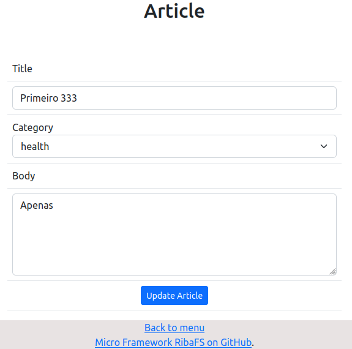

## Valor default em select

Tenho um pequeno CRUD com PHP e MVC, MySQL e Bootstrap. Quero clicar no link edit do index e o form edit abrir com o select já com o valor default vindo do banco.

### Tabela

Eu tenho uma tabela simples

```sql
create table articles(
	id int primary key auto_increment,
	title varchar(50) not null,
	body text not null,
	category enum('health', 'reflections','education') default 'reflections'
);	
```

## Edit do Controller

```php
    public function edit($field_id)
    {
        if (isset($field_id)) {
            $Article = new Article('articles');
            $fetch = $Article->fetch($field_id);

            if ($fetch === false) {
                $error = new \Core\ErrorController();
                $error->index();
            } else {
                require_once APP . 'views/templates/header.php';
			    require_once APP . 'views/templates/menu.php';                        
                require_once APP . 'views/articles/edit.php';
                require_once APP . 'views/templates/footer.php';
            }
        } else {
            header('location: ' . URL . 'article/index');
        }
    }
```
## A view edit

No form edit eu preciso que, quando clicar num registro do index, ele já trazer o valor do campo property do select preenchido como default. Como o select é fixo e criado com o campo tipo enum do MySQL, eu apenas trago o valor no option selected, os demais options continuam fixos e disponíveis no select do form edit. 
Depois irei criar uma versão que tem um campo tipo varchar na tabela e usa um select dinâmico criado com o PHP e populando os options dinamicamente.
```html
...
        <form action="<?php echo URL; ?>article/update" method="POST">   
        <table class="table table-hover table-stripped">
            <tr><td><label>Title</label></td></tr>
            <tr><td><input class="form-control" type="text" name="title" value="<?php echo htmlspecialchars($fetch->title, ENT_QUOTES, 'UTF-8'); ?>" required autofocus/></td></tr>
            <tr><td><label>Category</label>
                <select class="form-select" name="category" aria-label="Default select category">
                  <option selected><?=htmlspecialchars($fetch->category, ENT_QUOTES, 'UTF-8')?></option>
                  <option value="health">Health</option>
                  <option value="reflections">Reflections</option>
                  <option value="education">Education</option>
                </select></td></tr>
            <tr><td><label>Body</label></td></tr>
            <tr><td><textarea cols="10" rows="5" class="form-control" name="body" required /><?php echo htmlspecialchars($fetch->body, ENT_QUOTES, 'UTF-8'); ?></textarea></tr>
            <input type="hidden" name="field_id" value="<?=htmlspecialchars($fetch->id, ENT_QUOTES, 'UTF-8')?>" />
            <tr><td class="text-center"><input type="submit" name="submit_update_article" value="Update Article" class="btn btn-primary btn-sm"/></td></tr>
		</table>
        </form>
...
```
Veja como fica



Ao clicar no select Category, ele abre com os options health, refletions e education.

#### Micro Framework RibaFS

Este código é parte de um pequeno blog que estou criando com um pequeno framework PHP, MVC e Rotas que estou criando. Logo estarei divulgando e sua finalidade é criar aplicativos, blogs e sites usando uma estrutura MVC com rotas.

Até ...


