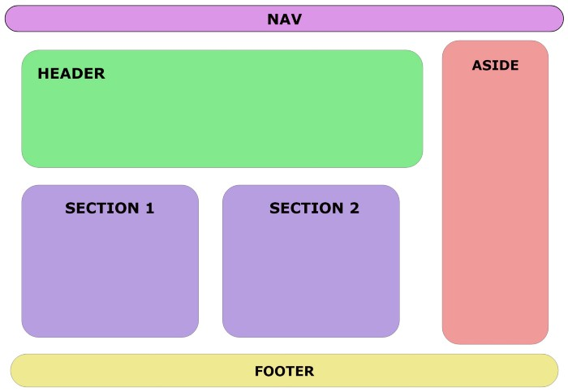

## Tags semânticas do HTML 5

As tags semâmticas não tem qualquer função na página vista pelo usuário, como o br, o h1, img, etc. Elas tem a função de organizar o código apenas para que seja melhor entendido pelo programador. Com elas deixamos o layout do código mais organizado e intuitivo.

Estas tags foram introduzidas pelo HTML 5. Antes todo o layout era criado se usando div, mas hoje podemos usar as tags semânticas.

Os elementos semânticos adicionados ao HTML5 foram:
```html
    <article>
    <aside>
    <details>
    <figcaption>
    <figure>
    <footer>
    <header>
    <main>
    <mark>
    <nav>
    <section>
    <summary>
    <time>
```


Elementos como ```<header>, <nav>, <section>, <article>, <aside> e <footer>``` funcionam mais ou menos como elementos ```<div>```. Eles agrupam outros elementos juntos em seções de uma página. Uma tag  ```<div>``` poderia conter qualquer tipo de informação. Contudo, é fácil identificar que tipo de informação seria incluída em uma tag semântica como ```<header>```.

Um exemplo de uma interface com elementos semânticos da w3schools
Por que usar elementos semânticos?

Para ver os benefícios dos elementos semânticos, aqui temos dois trechos de código em HTML. Esse primeiro bloco de código utiliza elementos semânticos:
```html
<header></header>
<section>
	<article>
		<figure>
			
			<figcaption></figcaption>
		</figure>
	</article>
</section>
<footer></footer>
```
Enquanto esse segundo bloco de código usa elementos não semânticos:
```html
<div id="header"></div>
<div class="section">
	<div class="article">
		<div class="figure">
			
			<div class="figcaption"></div>
		</div>
	</div>
</div>
<div id="footer"></div>
```
O primeiro é muito mais fácil de ler. Essa, provavelmente, é a primeira coisa que você notará quando for ler o primeiro trecho de código, que está usando elementos semânticos. Esse é um exemplo pequeno. Porém, como programador, você lerá centenas ou milhares de linhas de código. Quanto mais fácil for ler e entender o código, mais fácil será seu trabalho.

Ele tem maior acessibilidade. Você não é o único que acha que elementos semânticos são mais fáceis de entender. Os algoritmos de indexação em sites de busca e as tecnologias assistivas (como leitores de tela para usuários com deficiência visual) também entenderão melhor o contexto e conteúdo do seu website, entregando uma melhor experiência para os usuários.

### Grande exemplo
```html
<body>
     <header>
         <h1>Cursos de programação</h1>
     </header>
     <main>
	     <nav>
			 <ul>
				 <li><a href=”#”>pagina 1</a>Início</li>
				 <li><a href=”#”>pagina 2</a>Item 1</li>
				 <li><a href=”#”>pagina 3</a>Item 2</li>
				 <li><a href=”#”>pagina 4</a>Item 3</li>
			 </ul>
		</nav>
         <section>
             <h2>Java</h2>
             <article>
                 <h3>Curso de JavaServer Faces</h3>
                 <p>Neste curso você aprenderá a desenvolver aplicações com JSF.</p>
             </article>
             <article>
                 <h3>Curso de Spring</h3>
                 <p>Neste curso você aprenderá utilizar o framework Spring.</p>
             </article>
         </section>
         <section>
             <h2>PHP</h2>
             <article>
                 <h3>Curso básico de PHP</h3>
                 <p>Conheça a linguagem de programação PHP.</p>
             </article>
             <article>
                 <h3>Curso de PDO</h3>
                 <p>Aprenda a acessar bancos de dados com PHP Data Objects.</p>
             </article>
         </section>
     </main>
     <footer>
         <p>MinhaEmpresa.com.br. Todos os direitos reservados.</p>
     </footer>
</body>
```
### Algumas Referências

- [https://www.devmedia.com.br/html-semantico-conheca-os-elementos-semanticos-da-html5/38065](https://www.devmedia.com.br/html-semantico-conheca-os-elementos-semanticos-da-html5/38065)
- [https://www.freecodecamp.org/portuguese/news/elementos-semanticos-do-html5-explicados/](https://www.freecodecamp.org/portuguese/news/elementos-semanticos-do-html5-explicados/)
- [https://medium.com/reprogramabr/semanticahtml5-5252b4937f0a](https://medium.com/reprogramabr/semanticahtml5-5252b4937f0a)


